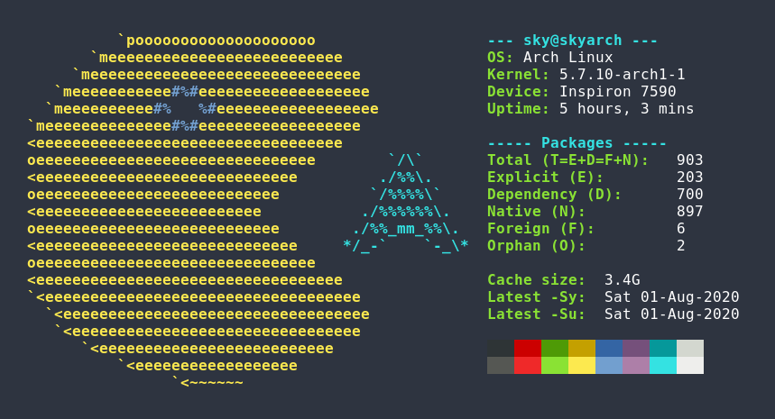
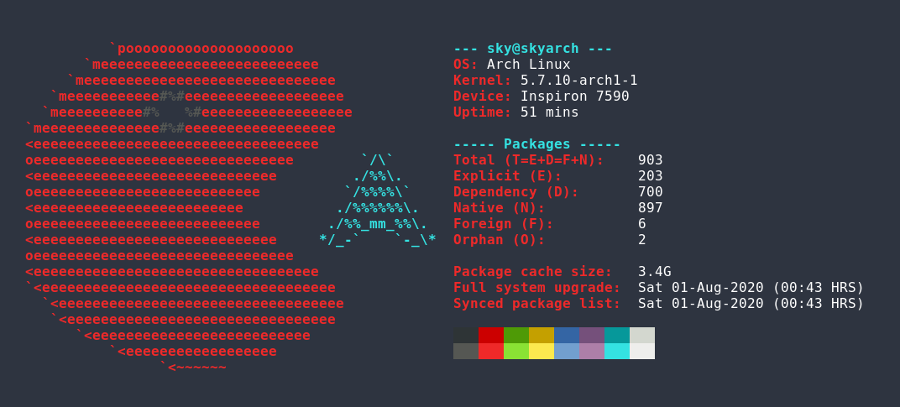

<h1 align="center">fetchpac</h1>

<h4 align="center">A command-line tool written in Bash for printing system package information.</h4>
 

### What is fetchpac?

Fetchpac is a command-line tool written in Bash for printing information about packages installed on your system in an aesthetic and visually pleasing way. It works for Arch Linux and Arch-based Linux distributions using the pacman package manager.

The overall goal of fetchpac is to provide a quick and broad overview of packages installed on your system, all with a single-word command "fetchpac". The information displayed can then be used for system maintenance and tracking of installed packages. This information is presented alongside an ASCII image of a pacman chasing after the Arch Linux logo, so it can be used in screenshots of your system.

### Features

It displays the total number of packages, split into different categories: explicit, dependency, native, foreign, orphan; the total size of package caches; and time of most recent full system upgrade and most recent synchronized package list.

More command-line options will continue to be added to customize the appearance, verbosity of displayed information, and explanations on package maintenance.

### Why is it called fetchpac?

Fetchpac was heavily inspired by tools such as screenfetch and neofetch that would "fetch" information about your system and display them in a similar format. The "pac" was so named because fetchpac displays package information, and utilizes the pacman package manager.  

  

