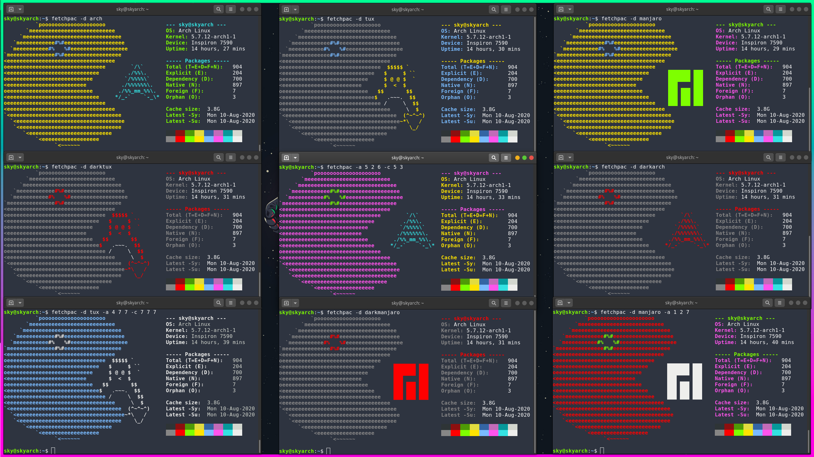

<h1 align="center">fetchpac</h1>

<h4 align="center">A command-line tool written in Bash for printing system package information.</h4>
<br>

### What is fetchpac?


- Command-line tool written in Bash
- Print information about packages installed on your system
- Works for Arch Linux and Arch-based Linux distributions using the pacman package manager

### Overall Goals
- Quick and broad overview of packages installed on your system
- Simple to use, with a single-word command "fetchpac"
- Used for system maintenance and tracking of installed packages
- Aesthetic: presented alongside an ASCII image of a yellow monster chasing after the Arch Linux logo, so it can be used in screenshots of your system
- Lightweight and fast
- Accurate; relies on package manager and system commands for querying of information

### Features
- Displays the total number of packages
- Split into different categories: explicit, dependency, native, foreign, orphan; the total size of package caches on your system; and time of most recent full system upgrade and most recent synchronized package list.
- Customize information, aesthetics, and displayed explanations (see below)

### Installation
This package is hosted on the Arch User Repository at <a href="https://aur.archlinux.org/packages/fetchpac-git">https://aur.archlinux.org/packages/fetchpac-git</a>. Alternatively, you may install the package manually:
```
git clone https://github.com/sky-aw/fetchpac.git
cd fetchpac
make install
```

### Customization
You can customize the display colors with 6 separate variables: 3 for the ASCII image, and 3 for the system and package information. Each variable has 17 color options. The final colors are selected using, from high to low precedence: command-line arguments, $HOME/.config/fetchpac/fetchpac.conf, /etc/fetchpac/fetchpac.conf. There is also an option to randomize all 6 color variables, which can be used alongside force-setting one or more of the variables.

There are multiple ASCII images available to choose from (examples shown below). Similarly, you can customize it with: (i) command-line arguments, (ii) $HOME/.config/fetchpac/fetchpac.conf, (iii) /etc/fetchpac/fetchpac.conf

There is a minimal option (example shown below), which also displays the system and package information, but omits the ASCII image.

More options will continue to be added to customize the appearance, verbosity of displayed information, and explanations on package maintenance.

### Why is it called fetchpac?

Fetchpac was heavily inspired by tools such as screenfetch and neofetch that would "fetch" information about your system and display them in a similar format. The "pac" was so named because fetchpac displays package information, and utilizes the pacman package manager.  

<p align="center">
  
</p>
<p align="center">
  
</p>